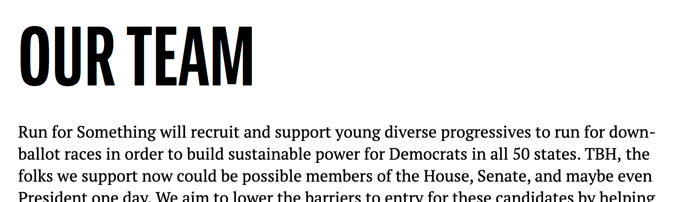

# Config

* $base_value: 16px;
* $device_mobile: 600px;
* $device_desktop: 1024px;

---

# Colors

* $rfs_blue: hsla(196, 100%, 47%, 1); //#00aeef
* $rfs_black: hsla(0, 0%, 0%, 1); //#000000
* $rfs_orange: hsla(38, 100%, 50%, 1); //#ffa100
* $rfs_red: hsla(358, 85%, 52%, 1); //#ed1c24
* $rfs_white: hsla(0, 100%, 100%, 1); //#ffffff
* $rfs_white2: hsla(0, 0%, 95%, 1); //#f1f1f1

---

# Fonts

* $font_head: "BerninaSans-Compressed", sans-serif;
* $font_text: "PT Serif", serif;

# Page

## Text 

| | Font | Size | Color | Weight | Margin | LineHeight |
| --- | --- | --- | --- | --- | --- | --- |
| (D) | PT Serif | 20px | black | normal | 0 0 20px 0 | 27px |
| (M) | "" | "" | "" | "" | "" | "" |


---

## Text - Links

| | Font | Size | Color | Weight | Margin | LineHeight |
| --- | --- | --- | --- | --- | --- | --- |
| (D) | PT Serif | 20px | blue | normal | 0 0 20px 0 | 27px |
| (M) | "" | "" | "" | "" | "" | "" |


---

## Text - Lists

| | Font | Size | Color | Weight | LineHeight |
| --- | --- | --- | --- | --- | --- |
| (D) | PT Serif | 20px | black | normal | 27px |
| (M) | "" | "" | "" | "" | "" |


---

## Primary Header - H1

| | Font | Size | Color | Weight |
| --- | --- | --- | --- | --- |
| (D) | BerninaSans | 150px | white | bold |
| (M) | "" | 96px | "" | "" |


```
<h1 class="primary-banner blue"></h1>
```

---

## Content Groups

---

### Default
| | Max-Width | Width | Margin | Padding |
| --- | --- | --- | --- | --- |
| (D) | 1170px | 100% | 0 auto | 100px 16px |
| (M) | "" | "" | "" | "" |


```
<div class="wp-block-group">
    <div class="wp-block-group__inner-container">
    </div>
</div>
```
---

### Narrow

| | Max-Width | Width | Margin | Padding |
| --- | --- | --- | --- | --- |
| (D) | 780px | 100% | 0 auto | 100px 16px |
| (M) | "" | "" | "" | "" |


```
<div class="wp-block-group narrow">
    <div class="wp-block-group__inner-container">
    </div>
</div>
```
---

### Wide

| | Max-Width | Width | Margin | Padding |
| --- | --- | --- | --- | --- |
| (D) | 100% | 100% | 0 auto | 100px 16px |
| (M) | "" | "" | "" | "" |


```
<div class="wp-block-group wide">
    <div class="wp-block-group__inner-container">
    </div>
</div>
```

---

### Background Colors

* white, white2, black, blue, red, orange   


```
<div class="wp-block-group black">
    <div class="wp-block-group__inner-container">
    </div>
</div>
```


---

## Sub Headers

### H2

| | Font | Size | Color | Weight | Margin | Line-Height |
| --- | --- | --- | --- | --- | --- | --- |
| (D) | BerninaSans | 96px | black | bold | 0 0 30px 0 | 1 |
| (M) | "" | 64px | "" | "" | "" | "" |



---

### H3

| | Font | Size | Color | Weight | Margin | Line-Height |
| --- | --- | --- | --- | --- | --- | --- |
| (D) | BerninaSans | 64px | black | bold | 0 0 30px 0 | 1.1 |
| (M) | "" | 48px | "" | "" | "" | "" |


---

### H4

| | Font | Size | Color | Weight | Margin | Line-Height |
| --- | --- | --- | --- | --- | --- | --- |
| (D) | BerninaSans | 48px | black | bold | 0 0 30px 0 | 1.2 |
| (M) | "" | 36px | "" | "" | "" | "" |


---

### H5

| | Font | Size | Color | Weight | Margin | Line-Height |
| --- | --- | --- | --- | --- | --- | --- |
| (D) | BerninaSans | 36px | black | bold | 0 0 20px 0 | 1.3 |
| (M) | "" | 30px | "" | "" | "" | "" |


---

### H6

| | Font | Size | Color | Weight | Margin | Line-Height |
| --- | --- | --- | --- | --- | --- | --- |
| (D) | BerninaSans | 24px | black | bold | 0 0 16px 0 | 1.4 |
| (M) | "" | "" | "" | "" | "" | "" |


---

## Buttons


```
<div class="flex-row">
	<div class="flex-large no-margin">
	    <a href="https://secure.actblue.com/donate/rfs?refcode=hwh" class="full-width no-radius no-border cta bg-red">Donate</a>
	</div>
	<div class="flex-large no-margin">
	    <a href="https://runforsomething.net/why/" class="full-width no-radius no-border cta bg-blue">Volunteer</a>
	</div>
</div>
```

---


## Blocks

### Row 3x1

* Image Ratio = 1.674418604651163 (1080x645)

| | Font | Size | Color | Weight | LineHeight |
| --- | --- | --- | --- | --- | --- |
| (D) | PT Serif | 20px | black | normal | 27px |
| (M) | PT Serif | 20px | black | normal | 27px |


